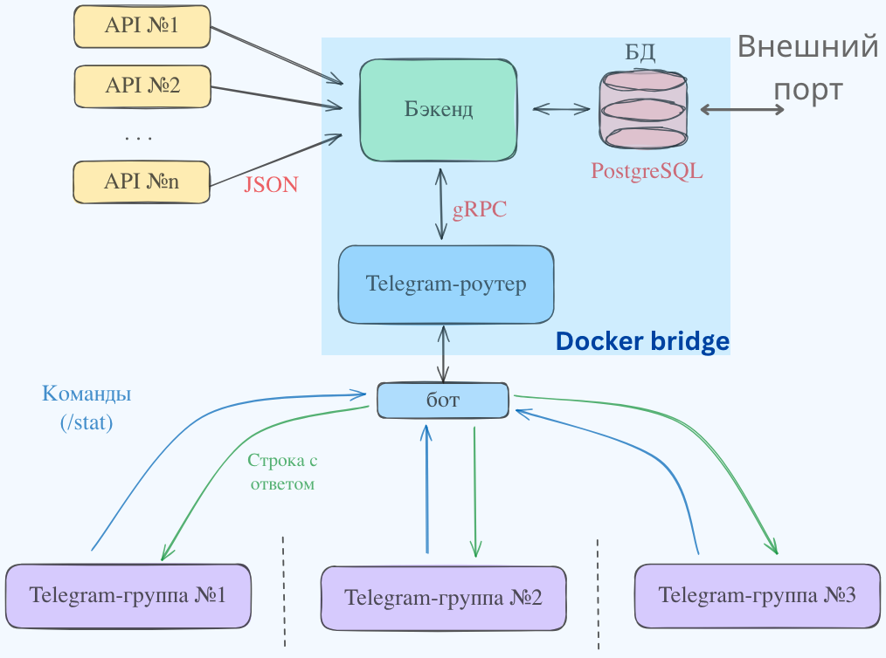
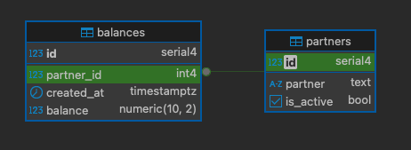

# Balance Monitor

**Balance Monitor** — это высоконагруженный микросервис для мониторинга балансов партнёрских рекламных сетей с возможностью настройки уведомлений через Telegram бота.

## Особенности

- Мониторинг балансов множества партнёрских сетей в реальном времени
- Удобное управление через Telegram-бота
- Высокая производительность благодаря асинхронной архитектуре
- История изменений балансов с возможностью анализа
- Полная контейнеризация с Docker

## Сценарии использования

- Аналитик получает отчёты о списаниях бюджета в Telegram по расписанию или по запросу командой `/stat`.
- Архитектура проекта позволяет легко масштабировать функциональность с минимальными изменениями в коде.

## Архитектура

Сервис построен по микросервисной архитектуре и состоит из следующих компонентов:

1. **partner_balance** - основной сервис (Go)
   - Сбор данных через REST API партнёрских сетей
   - Обработка и агрегация данных
   - Хранение в PostgreSQL
   - gRPC API для взаимодействия с другими сервисами
   - Покрытие тестами внутренней логики

2. **tg_router** - Telegram бот (Go)
   - Пользовательский интерфейс
   - Обработка команд и уведомлений
   - Интеграция с основным сервисом через gRPC
   - Возможность масштабирования - быстрая интеграция в любое количество чатов

3. **PostgreSQL** - основное хранилище данных
   - Хранение истории балансов
   - Настройки пользователей

## Взаимодействие с ботом

- `/stat` - получение статистики
- Ежедневно в 10:15 и 17:15 бот самостоятельно присылает статистику.

## Технологический стек

- **Язык программирования**: Go 1.24+
- **База данных**: PostgreSQL 14+
- **API**: gRPC, REST
- **Оркестрация**: Docker, Docker Compose
- **Мониторинг**: Prometheus, Grafana (в планах)
- **Логирование**: Logrus

## Демонстрация

### Схема сервиса

### Диаграмма БД
